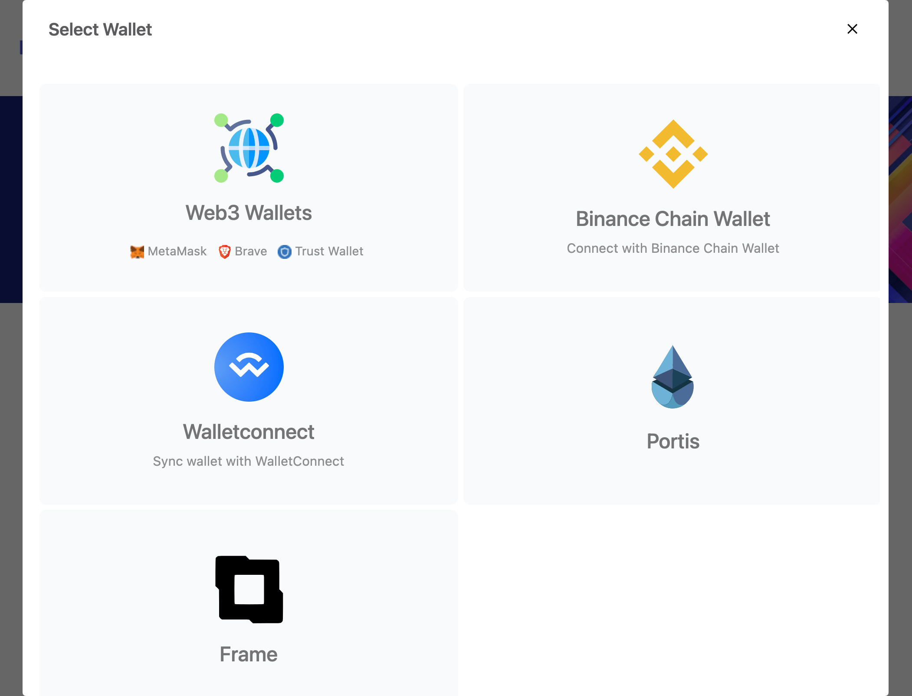

# WalletProvider
Wallet Provider is a lightweight library which provides a single api for Dapps to interact with various wallets. The main goal and purpose is to support all major blockchains & wallets.

Any library meant for frontend use should be light-weight enough. 
Wallet provider is only 6.8kB minified & gzipped.



## Code Repository
https://github.com/libertypie/Wallet-Provider
## Installation 

#### via npm 
```sh
npm i --save @libertypie/wallet-provider
```

#### via yarn 
```sh
yarn add @libertypie/wallet-provider
```

## Usage
#### ES6
```js
import WalletProvider from "@libertypie/wallet-provider"
```
#### Typescript
```js
import WalletProvider from "@libertypie/wallet-provider/src/index"
```


```js

    let providers = {
        "web3_wallets": {
             connect_text: "Connect with Metamask or Brave"
        },
        "binance_chain_wallet": {
            connect_text: "Connect with Binance Chain Wallet"
        },
    };

    let walletProvider = new WalletProvider({
        cacheProvider: true,
        providers,
        debug: true
    });

    let connectStatus = await walletProvider.connect();

    if(connectStatus.isError()){
        //some error info
        return;
    }

    //lets retrieve the connection info object
    // {provider, chainId, account}
    let resultInfo = connectStatus.getData();

    let provider = resultInfo.provider;
    let account = resultInfo.account;
    let chainId = resultInfo.chainId;

```

#### Methods
##### connect():
Establish a connection between the dApp and the wallet, if providerCache was enabled on previous connection and a cache exists,
the previously connected provider will be used, otherwise a modal will be opened for user to select a provider.

```js 
    //returns a Status object.
    let connectResult = await  walletProvider.connect();

    if(connectStatus.isError()){
        //some error info
        return;
    }

    //lets retrieve the connection info object
    // {provider, chainId, account}
    let resultInfo = connectStatus.getData();

    let provider = resultInfo.provider;
    let account = resultInfo.account;
    let chainId = resultInfo.chainId;
```


##### showModal():
manually open the modal, this method returns selected provider id
```js 
let selectedProviderId = await walletProvider.showModal();
```
##### closeModal():
manually close the modal, returns void 
```js 
 await walletProvider.closeModal();
```

#### Events
There are two ways to listen to events, 
    1. on the provider\
    2. from Wallet Provider object it self\

Wallet Provider events are the same as the provider's event but with support for custom provider events.\
Example:\
 Portis custom event mapping\ 
 onActiveWalletChanged(walletAddress,()=>{}) =>  walletProvider.on("accountsChanged",()=>{})

```js

    //listen to modal open
    walletProvider.on("modalOpen",(modal)=>{
        console.log(`Modal ${modal.id} opened`)
    })

    //modal close event
    walletProvider.on("modalClose",(modal)=>{
        console.log(`Modal ${modal.id} closed`)
    })

    //wallet connected successful event
    walletProvider.on("connect",({provider,chainId,account})=>{
        console.log("Wallet Connection Successful")
    })  

    //wallet connection failed
    walletProvider.on("connectError",(error: Error)=>{
        console.log("Wallet Connection Error")
    })

    //wallet's current account is changed
    //@param Array<string> accounts
    walletProvider.on("accountsChanged",(accountsArray)=>{
        console.log("Accounts is changed")
        console.log(`new account ${accountsArray[0]}`)
    })

    //wallet's current chain is changed
    //@param Array<string> accounts
    walletProvider.on("chainChanged",(chainId)=>{
        console.log("Chain is changed")
        console.log(`new chain id ${chainId}`)
    })


    //wallet or web3 disconnected
    walletProvider.on("disconnect",(error)=>{
        console.log("Disconnected")
        console.log(error.message,error.code)
    })  


    //listen to general errors
    walletProvider.on("error",(error)=>{
        console.log("an Error occurred")
        console.log(error.message,error.code)
    })  
```

### Wallets & Integrations
Wallet Provider  has a native support for several wallets, below is the list of supported wallets & how to embed them

  1. [Web3 Wallets: Metamask, Dapper, TrustWallet, Brave & most extension wallets](docs/web3-wallets.md)